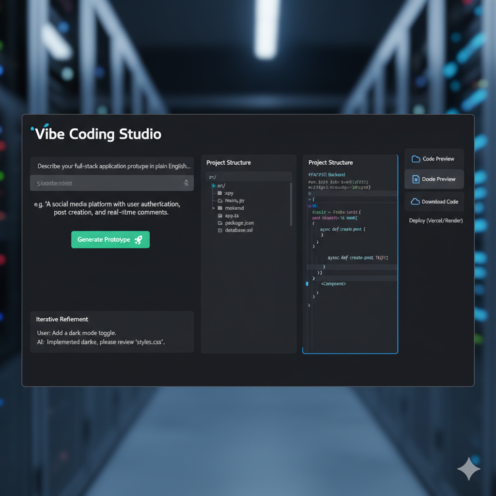

Vibe Coding Studio – AI-Directed Prototype Generator

Overview

Vibe Coding Studio is a local-first, AI-powered tool that turns plain-English prompts into a structured full‑stack prototype you can inspect and iterate on. It uses a FastAPI backend wired to a local LLM (Llama 3.2 via Ollama) and a React + TypeScript + Vite frontend with Monaco Editor for code preview and refinement.



Key Features

- AI-directed code generation using local Llama 3.2 (Ollama)
- Structured output: file tree + code contents as JSON
- Iterative refinement: send follow-up prompts referencing generated files
- Code preview with Monaco Editor
- Local file writer service to materialize generated files

Architecture

- Backend: FastAPI (Python), integrates with Ollama for Llama 3.2
- Frontend: React, TypeScript, Vite, Monaco Editor
- Data Flow: Frontend prompt -> Backend -> LLM -> JSON structure (files, paths, contents) -> Preview in UI -> Optional write to disk

Prerequisites

- Node.js 18+
- Python 3.10+
- Ollama installed and running locally
  - Install: see `https://ollama.com`
  - Pull model: `ollama pull llama3.2`
  - Ensure the Ollama service is running before starting the backend

Getting Started

1) Clone and open this repository

2) Backend setup

```bash
cd backend
python -m venv .venv
# macOS/Linux:
source .venv/bin/activate
# Windows PowerShell:
. .venv\\Scripts\\Activate.ps1
# Windows CMD:
.venv\\Scripts\\activate.bat
pip install -r requirements.txt
uvicorn app.main:app --reload --port 8000
```

Environment variables (optional)

- OLLAMA_HOST: Default `http://localhost:11434`
- MODEL_NAME: Default `llama3.2`

3) Frontend setup

```bash
cd frontend
npm install
# ensure Vite client types are available for TS
echo "/// <reference types=\"vite/client\" />" > src/vite-env.d.ts
npm run dev
```

Open the app

- Frontend dev server: `http://localhost:5173`
- Backend API: `http://localhost:8000`

Core API Endpoints

- POST `/api/generate` — Generate a project structure from a prompt
  - Body: `{ "prompt": string, "context": string | null }`
  - Returns: `{ files: Array<{ path: string, content: string }>, meta: {...} }`

- POST `/api/write` — Write generated files to disk
  - Body: `{ "rootDir": string, "files": Array<{ path: string, content: string }> }`

Notes on Local LLM

- This project uses a local model (Llama 3.2) through Ollama and does not require any cloud API keys.
- You can switch models by setting `MODEL_NAME` and pulling it with Ollama.

Troubleshooting

- TypeScript error: "Cannot find type definition file for 'vite/client'"
  - Ensure `frontend/src/vite-env.d.ts` contains:
    ```
    /// <reference types="vite/client" />
    ```
  - In `frontend/tsconfig.json`, remove the `types` entry or set it to `[]`.
  - Run `npm install` in `frontend`.

Repository Structure

```
backend/
  app/
    __init__.py
    main.py
    schemas.py
    ollama_client.py
  requirements.txt
frontend/
  index.html
  vite.config.ts
  tsconfig.json
  package.json
  src/
    main.tsx
    App.tsx
    vite-env.d.ts
README.md
```

Project Section (Profile Copy)

Project Title
Vibe Coding Studio – AI-Directed Prototype Generator

Tag this project with your employment/education
UG – Computers

Client
Personal Project

Project Status
Completed (Personal Project)


Details of Project (under 1000 chars)
Designed and developed an AI-powered "Vibe Coding" platform that enables users to generate full-stack application prototypes using plain English prompts. Built a scalable architecture with FastAPI (backend), React + TypeScript (frontend), and local Llama 3.2 via Ollama for on-device inference. Integrated structured JSON generation to produce code files and project trees, enabled iterative refinement, code preview (Monaco Editor), and local file writing to materialize results. This project demonstrates applied skills in LLM integration, system design, and building AI copilots for developer workflows.


Role Description 
Led end-to-end design and development of an AI-powered prototype generator, integrating a local LLM with backend services, React frontend, and robust UX to create a practical AI coding assistant.

Skills Used 
React, TypeScript, FastAPI, PostgreSQL , Redis, Docker, Vite, Monaco, Ollama (Llama 3.2), LangChain , GitHub Actions (CI), AWS S3 .


